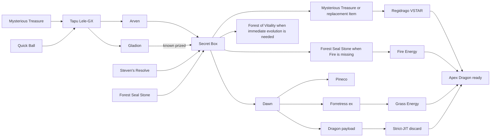

# Named-Deck Setup Comparison

This report is generated from [`../results/multi_deck_comparison.csv`](../results/multi_deck_comparison.csv) and [`../results/multi_deck_manifest.json`](../results/multi_deck_manifest.json).

Fixed seed: `20260705`. Trials per condition: `100,000`. Conditions: `32`. Total simulated games: `3,200,000`.

Both decks use the same derived seed for each scenario. This common-random-number design reduces comparison noise while preserving the historical shell seed schedule. `regidrago-shell` remains the default when `--deck` is omitted. `regidrago-pineco` is the Secret Box recipe with Pineco, Forretress ex, Dawn, Forest of Vitality, and Appletun `sv8-140`. The withdrawn Pineco Brilliant Blender variant is absent from the registry and results.

## Direct comparison

| Scenario | Shell T2 | Pineco T2 | Δ T2 | Shell T3 | Pineco T3 | Δ T3 | Shell T4 | Pineco T4 | Δ T4 |
|---|---:|---:|---:|---:|---:|---:|---:|---:|---:|
| Strict JIT, going first | 12.032% | 18.453% | +6.421 pp | 37.987% | 44.392% | +6.405 pp | 54.666% | 61.743% | +7.077 pp |
| Strict JIT, going second | 28.476% | 46.259% | +17.783 pp | 51.490% | 60.914% | +9.424 pp | 62.919% | 71.381% | +8.462 pp |
| Matchup-flex JIT, going first | 16.292% | 19.947% | +3.655 pp | 47.246% | 45.712% | -1.534 pp | 63.185% | 63.425% | +0.240 pp |
| Matchup-flex JIT, going second | 36.544% | 48.670% | +12.126 pp | 60.489% | 63.739% | +3.250 pp | 70.908% | 73.545% | +2.637 pp |
| No discard control, going first | 19.963% | 24.583% | +4.620 pp | 55.349% | 57.570% | +2.221 pp | 71.524% | 73.523% | +1.999 pp |
| No discard control, going second | 39.949% | 58.486% | +18.537 pp | 67.000% | 72.731% | +5.731 pp | 78.492% | 81.277% | +2.785 pp |

## Regidrago shell

| Scenario | T2 ± SE | T3 ± SE | T4 ± SE | Failure ± SE |
|---|---:|---:|---:|---:|
| Strict JIT, going first | 12.032% ± 0.103 | 37.987% ± 0.153 | 54.666% ± 0.157 | 45.334% ± 0.157 |
| Matchup-flex JIT, going first | 16.292% ± 0.117 | 47.246% ± 0.158 | 63.185% ± 0.153 | 36.815% ± 0.153 |
| No discard control, going first | 19.963% ± 0.126 | 55.349% ± 0.157 | 71.524% ± 0.143 | 28.476% ± 0.143 |
| Strict JIT, turn-two Item lock, first | 4.614% ± 0.066 | 10.317% ± 0.096 | 17.743% ± 0.121 | 82.257% ± 0.121 |
| Strict JIT, full Item lock, first | 2.777% ± 0.052 | 7.457% ± 0.083 | 14.725% ± 0.112 | 85.275% ± 0.112 |
| Strict JIT, Rule Box Ability lock, first | 4.456% ± 0.065 | 25.613% ± 0.138 | 38.690% ± 0.154 | 61.310% ± 0.154 |
| Strict JIT, combined lock, first | 0.282% ± 0.017 | 3.243% ± 0.056 | 7.154% ± 0.081 | 92.846% ± 0.081 |
| Strict JIT, going second | 28.476% ± 0.143 | 51.490% ± 0.158 | 62.919% ± 0.153 | 37.081% ± 0.153 |
| Matchup-flex JIT, going second | 36.544% ± 0.152 | 60.489% ± 0.155 | 70.908% ± 0.144 | 29.092% ± 0.144 |
| No discard control, going second | 39.949% ± 0.155 | 67.000% ± 0.149 | 78.492% ± 0.130 | 21.508% ± 0.130 |
| Strict JIT, turn-two Item lock, second | 13.864% ± 0.109 | 27.435% ± 0.141 | 35.054% ± 0.151 | 64.946% ± 0.151 |
| Strict JIT, full Item lock, second | 10.606% ± 0.097 | 22.843% ± 0.133 | 30.026% ± 0.145 | 69.974% ± 0.145 |
| Strict JIT, Rule Box Ability lock, second | 17.890% ± 0.121 | 34.398% ± 0.150 | 44.553% ± 0.157 | 55.447% ± 0.157 |
| Strict JIT, combined lock, second | 2.360% ± 0.048 | 11.398% ± 0.100 | 15.487% ± 0.114 | 84.513% ± 0.114 |
| Strict JIT, Supporter lock, first | 0.003% ± 0.002 | 10.062% ± 0.095 | 16.692% ± 0.118 | 83.308% ± 0.118 |
| Strict JIT, Supporter lock, second | 5.830% ± 0.074 | 14.094% ± 0.110 | 20.166% ± 0.127 | 79.834% ± 0.127 |

### First-ready-turn distribution

| Scenario | Ready on T2 | Ready on T3 | Ready on T4 | Ready on T5 diagnostic |
|---|---:|---:|---:|---:|
| Strict JIT, going first | 12.032% | 25.955% | 16.679% | 10.640% |
| Matchup-flex JIT, going first | 16.292% | 30.954% | 15.939% | 9.767% |
| No discard control, going first | 19.963% | 35.386% | 16.175% | 9.033% |
| Strict JIT, going second | 28.476% | 23.014% | 11.429% | 7.926% |
| Matchup-flex JIT, going second | 36.544% | 23.945% | 10.419% | 6.929% |
| No discard control, going second | 39.949% | 27.051% | 11.492% | 6.484% |

## Regidrago-Pineco with Secret Box

| Scenario | T2 ± SE | T3 ± SE | T4 ± SE | Failure ± SE |
|---|---:|---:|---:|---:|
| Strict JIT, going first | 18.453% ± 0.123 | 44.392% ± 0.157 | 61.743% ± 0.154 | 38.257% ± 0.154 |
| Matchup-flex JIT, going first | 19.947% ± 0.126 | 45.712% ± 0.158 | 63.425% ± 0.152 | 36.575% ± 0.152 |
| No discard control, going first | 24.583% ± 0.136 | 57.570% ± 0.156 | 73.523% ± 0.140 | 26.477% ± 0.140 |
| Strict JIT, turn-two Item lock, first | 4.706% ± 0.067 | 7.986% ± 0.086 | 13.602% ± 0.108 | 86.398% ± 0.108 |
| Strict JIT, full Item lock, first | 2.784% ± 0.052 | 5.742% ± 0.074 | 11.124% ± 0.099 | 88.876% ± 0.099 |
| Strict JIT, Rule Box Ability lock, first | 5.374% ± 0.071 | 19.251% ± 0.125 | 32.041% ± 0.148 | 67.959% ± 0.148 |
| Strict JIT, combined lock, first | 0.636% ± 0.025 | 1.864% ± 0.043 | 4.303% ± 0.064 | 95.697% ± 0.064 |
| Strict JIT, going second | 46.259% ± 0.158 | 60.914% ± 0.154 | 71.381% ± 0.143 | 28.619% ± 0.143 |
| Matchup-flex JIT, going second | 48.670% ± 0.158 | 63.739% ± 0.152 | 73.545% ± 0.139 | 26.455% ± 0.139 |
| No discard control, going second | 58.486% ± 0.156 | 72.731% ± 0.141 | 81.277% ± 0.123 | 18.723% ± 0.123 |
| Strict JIT, turn-two Item lock, second | 6.710% ± 0.079 | 12.105% ± 0.103 | 17.884% ± 0.121 | 82.116% ± 0.121 |
| Strict JIT, full Item lock, second | 4.701% ± 0.067 | 9.543% ± 0.093 | 15.100% ± 0.113 | 84.900% ± 0.113 |
| Strict JIT, Rule Box Ability lock, second | 13.212% ± 0.107 | 25.673% ± 0.138 | 36.227% ± 0.152 | 63.773% ± 0.152 |
| Strict JIT, combined lock, second | 1.370% ± 0.037 | 3.298% ± 0.056 | 5.573% ± 0.073 | 94.427% ± 0.073 |
| Strict JIT, Supporter lock, first | 1.124% ± 0.033 | 5.935% ± 0.075 | 10.040% ± 0.095 | 89.960% ± 0.095 |
| Strict JIT, Supporter lock, second | 4.968% ± 0.069 | 9.670% ± 0.093 | 13.845% ± 0.109 | 86.155% ± 0.109 |

### First-ready-turn distribution

| Scenario | Ready on T2 | Ready on T3 | Ready on T4 | Ready on T5 diagnostic |
|---|---:|---:|---:|---:|
| Strict JIT, going first | 18.453% | 25.939% | 17.351% | 10.545% |
| Matchup-flex JIT, going first | 19.947% | 25.765% | 17.713% | 10.500% |
| No discard control, going first | 24.583% | 32.987% | 15.953% | 8.075% |
| Strict JIT, going second | 46.259% | 14.655% | 10.467% | 6.706% |
| Matchup-flex JIT, going second | 48.670% | 15.069% | 9.806% | 6.333% |
| No discard control, going second | 58.486% | 14.245% | 8.546% | 5.047% |

## Secret Box route graph

The graph is adaptive. Held cards, prior-turn setup, legal Prize knowledge, and ordinary evolution can remove a search category. The policy reserves every additional discard cost before paying Secret Box.

## Route-frequency diagnostics

The following row is `regidrago-pineco`, no-discard-control, going second. Counts may overlap because one rejected state can miss several axes.

| Route metric | Value |
|---|---:|
| Secret Box use | 62.543% |
| Exploding Energy use | 82.982% |
| Steven use | 36.216% |
| Star Alchemy use | 46.376% |
| Secret Box attempts | 1.558 per game |
| Cost blocks | 0.050 per game |
| Missing route axis | 0.881 per game |
| Bench blocks | 0.001 per game |
| Arven banks | 0.275 per game |
| Steven banks | 0.306 per game |
| Gladion banks | 0.041 per game |
| FSS banks | 0.043 per game |

### Overlapping axis and zone counters

| Overlapping failure reason | Events per game |
|---|---:|
| Regidrago line | 0.396 |
| Pineco/Forretress line | 0.496 |
| VSTAR | 0.004 |
| Payload | 0.000 |
| Search Item | 0.004 |
| Fire | 0.029 |
| Grass | 0.002 |
| Ability | 0.000 |
| Supporter | 0.169 |
| Known Prize zone | 0.526 |
| Discard zone | 0.300 |
| Stranded hand zone | 0.181 |

## Why more Basics did not guarantee a faster deck

Four Tapu Lele-GX and two Pineco reduce mulligans, while they also lower the probability of opening Regidrago V. Active Tapu or Pineco can require a retreat or switch plan, the six support Pokémon compete for Bench space, and partially drawn Pineco pieces have value only when the full route can execute. Secret Box requires three other hand cards, while Mysterious Treasure may require another cost. Prizing can collapse the ACE SPEC, Forest, Forest Seal Stone, Pineco line, VSTAR, Fire channel, or connector path. Item, Supporter, and Rule Box Ability locks remove different parts of the chain.

The corrected planner distinguishes sequential Supporters from same-turn contention. A planned T1 Arven, Gladion, or Steven play can be followed by T2 Dawn. It also compares direct shell-style completion against the Pineco route before committing resources.

## Boundary

These percentages estimate setup readiness under the documented goldfish policy. They are not match-win rates. The model does not assign strategic value to giving up two Prizes through Exploding Energy, repeated attacks, opponent damage, gust, hand disruption, or full format legality.

## Provenance

Simulator policy digest: `cc3dcc4f74fc3b4e4af2227786ef9c0710ebdedac6cc1c9a5a333037430db678`.

Comparison CSV SHA-256: `3923d7b4925fd1dd2d4baae9e0234abf65a444f08b3b807efd52e2fd31bb9a57`.
