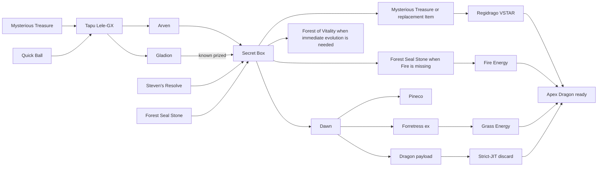

# Named-Deck Setup Comparison

This report is generated from [`../results/multi_deck_comparison.csv`](../results/multi_deck_comparison.csv) and [`../results/multi_deck_manifest.json`](../results/multi_deck_manifest.json).

Fixed seed: `20260705`. Trials per condition: `100,000`. Conditions: `32`. Total simulated games: `3,200,000`.

Both decks use the same derived seed for each scenario. This common-random-number design reduces comparison noise while preserving the historical shell seed schedule. `regidrago-shell` remains the default when `--deck` is omitted. `regidrago-pineco` is the Secret Box recipe with Pineco, Forretress ex, Dawn, Forest of Vitality, and Appletun `sv8-140`. The withdrawn Pineco Brilliant Blender variant is absent from the registry and results.

Turn-one full Item-lock rows are intentionally omitted and must not be reintroduced as current-paper Expanded matchup scenarios. Use the turn-two Item-lock rows. Combined lock means Rule Box Ability suppression plus Item lock beginning on turn 2. Sources: https://www.pokemon.com/static-assets/content-assets/cms2/pdf/trading-card-game/rulebook/mew_rulebook_en.pdf https://www.pokemon.com/es/sol-luna-sombras-ardientes-anuncio-trimestral-sobre-lista-de-cartas-prohibidas-y-cambios-en-las-reglas/ https://github.com/FlareZ123/pokemon-sims/issues/2247

## Direct comparison

| Scenario | Shell T2 | Pineco T2 | Δ T2 | Shell T3 | Pineco T3 | Δ T3 | Shell T4 | Pineco T4 | Δ T4 |
|---|---:|---:|---:|---:|---:|---:|---:|---:|---:|
| Strict JIT, going first | 12.234% | 8.253% | -3.981 pp | 41.859% | 32.058% | -9.801 pp | 69.564% | 60.037% | -9.527 pp |
| Strict JIT, going second | 29.794% | 18.209% | -11.585 pp | 55.667% | 49.564% | -6.103 pp | 78.247% | 72.889% | -5.358 pp |
| Matchup-flex JIT, going first | 17.152% | 11.911% | -5.241 pp | 50.658% | 40.860% | -9.798 pp | 75.958% | 68.938% | -7.020 pp |
| Matchup-flex JIT, going second | 37.410% | 24.336% | -13.074 pp | 64.307% | 56.970% | -7.337 pp | 84.658% | 78.930% | -5.728 pp |
| No discard control, going first | 19.740% | 15.507% | -4.233 pp | 56.829% | 51.409% | -5.420 pp | 81.159% | 76.635% | -4.524 pp |
| No discard control, going second | 40.448% | 29.044% | -11.404 pp | 68.575% | 63.395% | -5.180 pp | 88.242% | 83.837% | -4.405 pp |

## Regidrago shell

| Scenario | T2 ± SE | T3 ± SE | T4 ± SE | Failure ± SE |
|---|---:|---:|---:|---:|
| Strict JIT, going first | 12.234% ± 0.104 | 41.859% ± 0.156 | 69.564% ± 0.145 | 23.792% ± 0.135 |
| Matchup-flex JIT, going first | 17.152% ± 0.119 | 50.658% ± 0.158 | 75.958% ± 0.135 | 16.571% ± 0.118 |
| No discard control, going first | 19.740% ± 0.126 | 56.829% ± 0.157 | 81.159% ± 0.124 | 12.013% ± 0.103 |
| Strict JIT, turn-two Item lock, first | 4.523% ± 0.066 | 10.518% ± 0.097 | 32.144% ± 0.148 | 57.567% ± 0.156 |
| Strict JIT, Rule Box Ability lock, first | 4.545% ± 0.066 | 28.165% ± 0.142 | 52.149% ± 0.158 | 35.381% ± 0.151 |
| Strict JIT, turn-two Item + Rule Box Ability lock, first | 0.779% ± 0.028 | 4.667% ± 0.067 | 21.197% ± 0.129 | 72.132% ± 0.142 |
| Strict JIT, going second | 29.794% ± 0.145 | 55.667% ± 0.157 | 78.247% ± 0.130 | 17.437% ± 0.120 |
| Matchup-flex JIT, going second | 37.410% ± 0.153 | 64.307% ± 0.151 | 84.658% ± 0.114 | 11.241% ± 0.100 |
| No discard control, going second | 40.448% ± 0.155 | 68.575% ± 0.147 | 88.242% ± 0.102 | 7.952% ± 0.086 |
| Strict JIT, turn-two Item lock, second | 14.077% ± 0.110 | 28.453% ± 0.143 | 49.435% ± 0.158 | 40.403% ± 0.155 |
| Strict JIT, Rule Box Ability lock, second | 18.419% ± 0.122 | 37.234% ± 0.153 | 64.471% ± 0.151 | 26.385% ± 0.139 |
| Strict JIT, turn-two Item + Rule Box Ability lock, second | 3.874% ± 0.061 | 14.683% ± 0.112 | 34.719% ± 0.151 | 56.857% ± 0.157 |
| Strict JIT, Supporter lock, first | 0.005% ± 0.002 | 16.426% ± 0.117 | 38.431% ± 0.154 | 51.342% ± 0.158 |
| Strict JIT, Supporter lock, second | 7.850% ± 0.085 | 20.357% ± 0.127 | 42.390% ± 0.156 | 46.512% ± 0.158 |
| Garbodor + Boost Shake Ability lock, first | 5.602% ± 0.073 | 25.112% ± 0.137 | 48.595% ± 0.158 | 39.669% ± 0.155 |
| Garbodor + Boost Shake Ability lock, second | 15.436% ± 0.114 | 30.671% ± 0.146 | 60.108% ± 0.155 | 30.093% ± 0.145 |

### First-ready-turn distribution

| Scenario | Ready on T2 | Ready on T3 | Ready on T4 | Ready on T5 diagnostic |
|---|---:|---:|---:|---:|
| Strict JIT, going first | 12.234% | 29.625% | 27.705% | 6.644% |
| Matchup-flex JIT, going first | 17.152% | 33.506% | 25.300% | 7.471% |
| No discard control, going first | 19.740% | 37.089% | 24.330% | 6.828% |
| Strict JIT, going second | 29.794% | 25.873% | 22.580% | 4.316% |
| Matchup-flex JIT, going second | 37.410% | 26.897% | 20.351% | 4.101% |
| No discard control, going second | 40.448% | 28.127% | 19.667% | 3.806% |

## Regidrago-Pineco with Secret Box

| Scenario | T2 ± SE | T3 ± SE | T4 ± SE | Failure ± SE |
|---|---:|---:|---:|---:|
| Strict JIT, going first | 8.253% ± 0.087 | 32.058% ± 0.148 | 60.037% ± 0.155 | 31.630% ± 0.147 |
| Matchup-flex JIT, going first | 11.911% ± 0.102 | 40.860% ± 0.155 | 68.938% ± 0.146 | 23.471% ± 0.134 |
| No discard control, going first | 15.507% ± 0.115 | 51.409% ± 0.158 | 76.635% ± 0.134 | 16.345% ± 0.117 |
| Strict JIT, turn-two Item lock, first | 2.998% ± 0.054 | 8.768% ± 0.089 | 28.234% ± 0.142 | 61.771% ± 0.154 |
| Strict JIT, Rule Box Ability lock, first | 3.643% ± 0.059 | 21.901% ± 0.131 | 46.527% ± 0.158 | 43.962% ± 0.157 |
| Strict JIT, turn-two Item + Rule Box Ability lock, first | 0.584% ± 0.024 | 3.774% ± 0.060 | 18.839% ± 0.124 | 74.774% ± 0.137 |
| Strict JIT, going second | 18.209% ± 0.122 | 49.564% ± 0.158 | 72.889% ± 0.141 | 21.910% ± 0.131 |
| Matchup-flex JIT, going second | 24.336% ± 0.136 | 56.970% ± 0.157 | 78.930% ± 0.129 | 16.020% ± 0.116 |
| No discard control, going second | 29.044% ± 0.144 | 63.395% ± 0.152 | 83.837% ± 0.116 | 11.559% ± 0.101 |
| Strict JIT, turn-two Item lock, second | 9.356% ± 0.092 | 23.152% ± 0.133 | 45.222% ± 0.157 | 43.451% ± 0.157 |
| Strict JIT, Rule Box Ability lock, second | 11.055% ± 0.099 | 29.252% ± 0.144 | 59.194% ± 0.155 | 31.042% ± 0.146 |
| Strict JIT, turn-two Item + Rule Box Ability lock, second | 2.311% ± 0.047 | 11.400% ± 0.101 | 32.677% ± 0.148 | 58.503% ± 0.156 |
| Strict JIT, Supporter lock, first | 0.000% ± 0.000 | 11.761% ± 0.102 | 34.983% ± 0.151 | 52.374% ± 0.158 |
| Strict JIT, Supporter lock, second | 3.313% ± 0.057 | 14.216% ± 0.110 | 38.631% ± 0.154 | 48.929% ± 0.158 |
| Garbodor + Boost Shake Ability lock, first | 3.831% ± 0.061 | 18.879% ± 0.124 | 41.672% ± 0.156 | 49.916% ± 0.158 |
| Garbodor + Boost Shake Ability lock, second | 9.272% ± 0.092 | 23.388% ± 0.134 | 53.594% ± 0.158 | 36.305% ± 0.152 |

### First-ready-turn distribution

| Scenario | Ready on T2 | Ready on T3 | Ready on T4 | Ready on T5 diagnostic |
|---|---:|---:|---:|---:|
| Strict JIT, going first | 8.253% | 23.805% | 27.979% | 8.333% |
| Matchup-flex JIT, going first | 11.911% | 28.949% | 28.078% | 7.591% |
| No discard control, going first | 15.507% | 35.902% | 25.226% | 7.020% |
| Strict JIT, going second | 18.209% | 31.355% | 23.325% | 5.201% |
| Matchup-flex JIT, going second | 24.336% | 32.634% | 21.960% | 5.050% |
| No discard control, going second | 29.044% | 34.351% | 20.442% | 4.604% |

## Secret Box route graph

```mermaid
graph LR
  MT[Mysterious Treasure] --> Tapu[Tapu Lele-GX]
  QB[Quick Ball] --> Tapu
  Tapu --> Arven
  Tapu --> Gladion
  Arven --> Box[Secret Box]
  Gladion -->|known prized| Box
  Steven[Steven's Resolve] --> Box
  FSS[Forest Seal Stone] --> Box
  Box --> Item[Mysterious Treasure or replacement Item]
  Box --> Tool[Forest Seal Stone when Fire is missing]
  Box --> Dawn
  Box --> Forest[Forest of Vitality when immediate evolution is needed]
  Dawn --> Pineco
  Dawn --> Forretress[Forretress ex]
  Dawn --> Payload[Dragon payload]
  Item --> VSTAR[Regidrago VSTAR]
  Tool --> Fire[Fire Energy]
  Forretress --> Grass[Grass Energy]
  Payload --> Discard[Strict-JIT discard]
  VSTAR --> Ready[Apex Dragon ready]
  Fire --> Ready
  Grass --> Ready
  Discard --> Ready
```

The graph is adaptive. Held cards, prior-turn setup, legal Prize knowledge, and ordinary evolution can remove a search category. The policy reserves every additional discard cost before paying Secret Box.

## Route-frequency diagnostics

The following row is `regidrago-pineco`, no-discard-control, going second. Counts may overlap because one rejected state can miss several axes.

| Route metric | Value |
|---|---:|
| Secret Box use | 34.955% |
| Exploding Energy use | 4.123% |
| Steven use | 15.439% |
| Star Alchemy use | 11.871% |
| Secret Box attempts | 0.509 per game |
| Cost blocks | 0.122 per game |
| Missing route axis | 0.049 per game |
| Bench blocks | 0.020 per game |
| Arven banks | 0.073 per game |
| Steven banks | 0.045 per game |
| Gladion banks | 0.004 per game |
| FSS banks | 0.010 per game |

### Overlapping axis and zone counters

| Overlapping failure reason | Events per game |
|---|---:|
| Regidrago line | 0.002 |
| Pineco/Forretress line | 0.013 |
| VSTAR | 0.007 |
| Payload | 0.006 |
| Search Item | 0.003 |
| Fire | 0.006 |
| Grass | 0.004 |
| Ability | 0.005 |
| Supporter | 0.000 |
| Known Prize zone | 0.000 |
| Discard zone | 0.000 |
| Stranded hand zone | 0.002 |

## Why more Basics did not guarantee a faster deck

Four Tapu Lele-GX and two Pineco reduce mulligans, while they also lower the probability of opening Regidrago V. Active Tapu or Pineco can require a retreat or switch plan, the six support Pokémon compete for Bench space, and partially drawn Pineco pieces have value only when the full route can execute. Secret Box requires three other hand cards, while Mysterious Treasure may require another cost. Prizing can collapse the ACE SPEC, Forest, Forest Seal Stone, Pineco line, VSTAR, Fire channel, or connector path. Item, Supporter, and Rule Box Ability locks remove different parts of the chain.

The corrected planner distinguishes sequential Supporters from same-turn contention. A planned T1 Arven, Gladion, or Steven play can be followed by T2 Dawn. It also compares direct shell-style completion against the Pineco route before committing resources.

## Boundary

These percentages estimate setup readiness under the documented goldfish policy. They are not match-win rates. The model does not assign strategic value to giving up two Prizes through Exploding Energy, repeated attacks, opponent damage, gust, hand disruption, or full format legality.

## Provenance

Simulator policy digest: `0e2370d47c7a95068d6285498e7f65a488b61012e7d61b90ff405db170ab3f8b`.

Comparison CSV SHA-256: `fb153f6246a23be31dc8d2a4a4376f4a5a96b058e9cbfcc2176a4effed91b234`.
